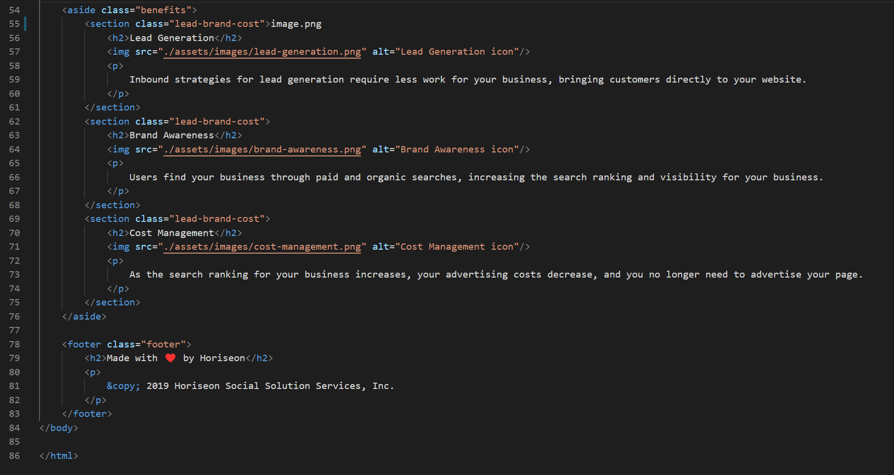

# 02-Challenge

Refactor Web Page

## Desription

The new and standardized webpage for Horiseon now is optimized with semantic HTML elements following a more logical structure not tethered to positioning and styles. You will also find that every image now has a an accessible alt attribute, and each heading attribute fall in sequential order based upon there sections. Lastly the title element know reads a more concise, descriptive title.




### My changes to HTML

```
Changed each h element to correct number in each sub section after the section containing the h1 element
Changing non-samantic element "div" to samantic element "header"
getting rid of "span" element and using "h1" as the selector on css page
getting rid of "div" and keeping "ul" and adjusting indentation for "<ul></ul>"
changing "div" to "figure"
changing "div" to "main"
changing "div" under "main" to "section" sematic elements
adding "id" so that nav funstion works for "Search Engine Optimization"
changing "div" to "aside"
changing "div" under "aside" to "section" sematic elements
changing "div" to "footer"
adding "alt" attributes to every image/icon
moving "class" attributes towards the front of every "img" attribute
within the <aside> every section class was made the same in order to consolidate the respective css selector
within the <main> every section class was made the same in order to consolidate the respective css selector
within <main> id's were irrelevant and removed
```

### My Changes to CSS

```
Changed the respective h elements in the CSS file to correlate with the new layout of the HTML file
Consolidated ".benefit-xxx" to just ".lead-brand-cost"
Consolidated ".benefit-xxx h3" to just ".lead-brand-cost h2"
Consolidated ".benefit-xxx img" to just ".lead-brand-cost img"
Consolidating all class pertaining to search engine, online reputation, and social media to the same class ".search-online-social"
Consolidating all .header selectors
removing ".seo" for ".header h1"
changing div to ul since ul replaced divs container for "header ul"
changing div to nav for ".header nav ul"
replacing div with nav to match with semantic html for ".header ul li"
reorganized selectors to follow semantic structure of html
```
